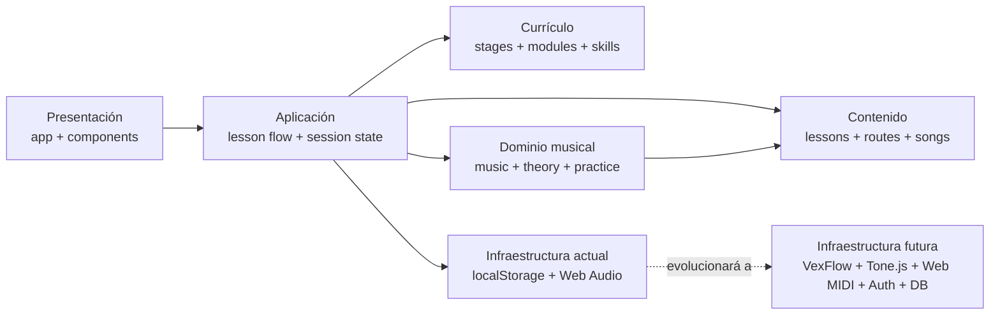
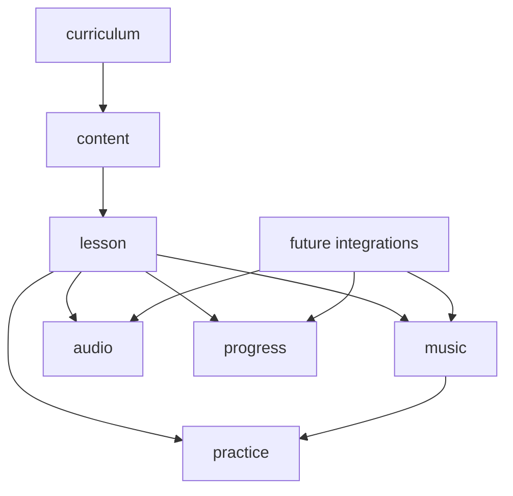
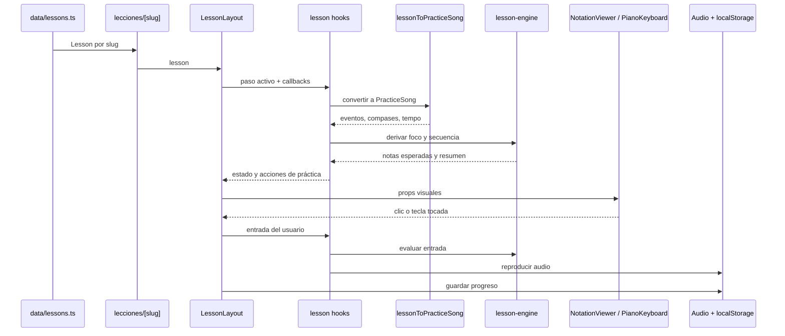

# Arquitectura de Piano Claro

## Estado actual

Piano Claro es hoy un **monolito modular** construido con Next.js App Router.
La aplicación se despliega como una sola unidad, pero ya separa varias
responsabilidades internas:

- presentación y navegación
- currículo y skill tree
- contenido educativo mock
- dominio musical
- motor de práctica
- audio local
- persistencia local de progreso

**Actualización Reciente (V2):** La aplicación ha comenzado a migrar de sus prototipos iniciales a una estructura de **Módulos estandarizados** (`/modulos/[id]/unidad-[id]`). Para garantizar una experiencia de usuario *premium* y cohesiva (con estética "Midnight Blue" y recursos 3D generados), el código y las rutas antiguas se han encapsulado en un directorio `/legacy/`.

Este enfoque es correcto para la etapa actual: mantiene bajo el costo operativo
sin renunciar a una evolución ordenada hacia audio real, MIDI, autenticación y
base de datos.

## Diagrama general

## Capas y carpetas

| Capa | Responsabilidad | Ubicación principal |
| --- | --- | --- |
| Presentación | páginas, layout, cards, visualización | `src/app`, `src/components` |
| Enrutamiento Moderno | Módulos interactivos y Dashboard premium | `src/app/modulos/`, `src/app/page.tsx` |
| Enrutamiento Legacy | Prototipos antiguos aislados para no romper UX | `src/app/legacy/` |
| Aplicación | flujo de lecciones, estado de sesión, navegación | `src/components/lesson/LessonLayout.tsx`, `src/components/lesson/hooks` |
| Currículo | etapas, módulos futuros, skill tree, ejercicios y desbloqueos | `src/types/curriculum.ts`, `src/data/curriculum.ts` |
| Dominio musical | notas, posiciones, teoría, canción practicable | `src/lib/music`, `src/types/music.ts`, `src/types/theory.ts` |
| Dominio de práctica | foco, feedback, secuencia, resumen de sesión | `src/lib/practice` |
| Datos mock | rutas, lecciones, repertorio, precios | `src/data` |
| Repositorios | fronteras reemplazables para contenido y progreso | `src/lib/content`, `src/lib/progress` |
| Infraestructura actual | audio y persistencia local | `src/lib/audio`, `src/lib/progress/local-storage-progress-repository.ts` |

## Módulos funcionales

### `curriculum`

- define la progresión macro de Piano Claro como skill tree musical
- separa etapas, módulos futuros, habilidades, ejercicios y reglas de desbloqueo
- permite evaluar avance por habilidad, no solo por lección completada
- archivos principales:
  - `src/types/curriculum.ts`
  - `src/data/curriculum.ts`
  - `docs/learning-system.md`

### `lesson`

- renderiza la experiencia de aprendizaje
- compone la pantalla de lección y delega progreso/práctica a hooks de aplicación
- componentes principales:
  - `LessonLayout`
  - `LessonHeader`
  - `LessonSidebar`
  - `LessonPracticeStatus`
  - `LessonToolsPanel`
  - `LessonNavigation`
  - `NotationViewer`
  - `LessonStepPanel`
  - `PracticeSessionPanel`
  - `PracticeSequenceStrip`
- hooks principales:
  - `useLessonProgress`
  - `useLessonPractice`
  - `useComputerKeyboardInput`

### `practice`

- decide qué parte de la lección se practica
- compara notas tocadas contra la nota esperada
- conserva una línea temporal completa de notas y silencios para la guía
- deriva mensajes y métricas de la sesión
- archivos principales:
  - `lesson-engine.ts`
  - `evaluate-note.ts`
  - `session.ts`

### `music`

- modela notas, pentagrama, teoría y canciones practicables
- concentra las primitivas musicales (`NoteName`, `SolfegeName`, duraciones y eventos)
- centraliza la autoría de compases en `score-authoring.ts`
- calcula la posición temporal de eventos en `notation-layout.ts`
- transforma un `ScoreMock` en `PracticeSong`
- normaliza medidas legacy a eventos de notación con notas o silencios
- archivos principales:
  - `notes.ts`
  - `notation.ts`
  - `notation-layout.ts`
  - `score-authoring.ts`
  - `song-model.ts`
  - `staff-position.ts`
  - `theory.ts`

### `audio`

- hoy usa Web Audio simple para notas y metrónomo
- en el futuro será el punto de integración con Tone.js o samples reales

### `notation`

- expone el contrato `NotationRendererProps`
- `NotationViewer` arma la superficie de partitura
- `PianoClaroSvgRenderer` es la implementación mock actual
- `NoteGlyph` y `RestGlyph` separan la forma visual de cada evento
- `renderer-registry.ts` define el punto de reemplazo para un futuro `VexFlowRenderer`

### `content`

- hoy usa TypeScript mock
- incluye rutas, lecciones, canciones, módulos y teoría adaptada
- entra a la app por `contentRepository`
- en el futuro podrá migrar a CMS o base de datos sin cambiar el dominio ni las páginas

### `progress`

- hoy usa `localStorage`
- entra a la app por `lessonProgressRepository`
- en el futuro podrá migrar a progreso remoto por usuario sin tocar los consumidores

## Flujo principal de datos

## Decisiones de diseño ya correctas

1. **Contenido separado de render**
   Las lecciones viven en datos y no están incrustadas dentro de las vistas.

2. **Dominio musical explícito**
   `PracticeSong` evita que la app dependa para siempre de mocks visuales.

3. **Infraestructura encapsulada**
   El audio está separado en `PianoAudioEngine`; el progreso local también.

4. **Preparación para crecimiento**
   `NotationViewer` y el registro de renderers dejan una frontera clara para
   reemplazar el SVG mock por VexFlow.

5. **Monolito apropiado para el momento**
   No hay complejidad operacional prematura.

6. **Repositorios explícitos**
   La UI ya no depende directamente de mocks ni de `localStorage`.

7. **Currículo independiente de las pantallas**
   El skill tree puede crecer sin acoplarse todavía a rutas o páginas concretas.

## Evolución recomendada

### Fase 1: endurecer el monolito actual

- [x] separar hooks/controladores para `LessonLayout`
- [x] retirar componentes legacy no usados
- [x] unificar tipos duplicados de lección
- [x] separar primitivas musicales de los tipos de lección
- [x] centralizar la autoría de compases para evitar helpers duplicados en contenido
- [x] crear mapa curricular de etapas, módulos, habilidades, ejercicios y desbloqueos
- [x] agregar tests de dominio para `song-model`, `lesson-engine` y `staff-position`

### Fase 2: Módulos interactivos y notación real (EN CURSO)

- [x] Refactorizar la arquitectura de rutas a `/modulos/[id]/unidad-[id]` (Módulo 1: Fundamentos).
- [x] Aislar prototipos antiguos en `/legacy/`.
- [x] Elevar la estética global ("Midnight Blue", Glassmorphism, Assets 3D).
- integrar VexFlow como renderer principal detrás del registro
- mantener el contrato `NotationRendererProps`
- introducir importación MusicXML/MIDI controlada
- [x] preparar eventos de notación para silencios y alteraciones
- [x] separar layout temporal de eventos y render inicial de silencios
- [x] incorporar silencios a la línea temporal de práctica
- agregar más ritmos y render real de alteraciones

### Fase 3: infraestructura de usuario

- autenticación
- progreso real por usuario
- base de datos
- sesiones, historial y logros

### Fase 4: hardware y feedback avanzado

- Web MIDI
- audio más realista
- evaluación temporal
- modos por mano y loop por compás

## Regla arquitectónica sugerida

La UI puede **consumir** el dominio, pero el dominio no debe depender de la UI.
Los datos pueden alimentar el dominio; la infraestructura debe entrar por
adaptadores claros. Esa regla simple mantendrá el proyecto escalable incluso
si sigue siendo un monolito por bastante tiempo.
