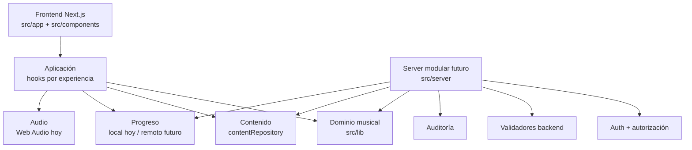

# Guía Para Desarrolladores Externos

Esta guía resume cómo trabajar en Piano Claro sin romper la arquitectura del
producto. Es la referencia operativa para incorporar nuevos módulos,
persistencia, autenticación o integraciones musicales.

## Estado Actual

Piano Claro es un monolito modular con Next.js App Router.

La aplicación se despliega como una sola unidad, pero internamente separa:

- presentación
- flujo de aplicación
- dominio musical
- contenido mock
- progreso local
- audio local
- base server preparada para auth, autorización, validación y auditoría

No hay microservicios. No deben agregarse sin una necesidad operacional clara.

## Capas

| Capa | Responsabilidad | Ubicación |
| --- | --- | --- |
| Presentación | Páginas y componentes React | `src/app`, `src/components` |
| Aplicación | Hooks y control de estado de experiencias interactivas | `src/components/**/hooks` |
| Dominio musical | Reglas de ritmo, intervalos, escalas, acordes, práctica y notación | `src/lib` |
| Datos mock | Contenido educativo y pricing temporal | `src/data` |
| Ruta de aprendizaje | Unidades que conectan teoría musical, lecciones de piano, habilidades y dominio | `src/data/learning-path.ts`, `src/lib/learning-path` |
| Repositorios | Fronteras reemplazables para contenido y progreso | `src/lib/content`, `src/lib/progress` |
| Infraestructura local | Web Audio, localStorage y analytics local | `src/lib/audio`, `src/lib/analytics` |
| Server modular futuro | Auth, autorización, validación, progreso oficial y auditoría | `src/server` |

Regla base:

```txt
UI -> hooks de aplicación -> dominio -> repositorios/adaptadores
```

La UI puede consumir dominio. El dominio no debe depender de React,
`localStorage`, cookies, auth ni rutas.

## Diagrama Lógico



## Módulos Funcionales

| Módulo | Responsabilidad |
| --- | --- |
| `lesson` | Lecciones de piano con partitura, teclado, feedback y práctica guiada |
| `learning-path` | Secuencia de autoaprendizaje que une teoría musical, lecciones de piano, competencias, criterios de dominio y reparación |
| `rhythm` | Timing, beat, scoring rítmico y progreso |
| `intervals` | Distancias visuales y auditivas |
| `major-scale` | Fórmula y práctica de escala mayor |
| `minor-scale` | Menor natural, armónica y melódica ascendente |
| `key-signature` | Armaduras, tonalidades y relativas |
| `pentatonic` | Pentatónicas e improvisación guiada |
| `chords` | Construcción y reconocimiento de tríadas |
| `music` | Notas, notación, staff position y modelo de canción |
| `practice` | Evaluación de práctica y foco pedagógico |
| `server` | Contratos futuros para seguridad backend |

## Carriles De Aprendizaje

La navegación principal separa el producto en dos carriles:

- **Teoría musical** (`/modulos`): módulos interactivos donde el usuario entiende conceptos musicales resolviendo ejercicios con teclado, audio, scoring y feedback.
- **Lecciones de piano** (`/lecciones`): sesiones guiadas para practicar lectura, teclado y repertorio por fragmentos pequeños.

La página `/rutas` debe explicar cómo se conectan ambos carriles. No debe
presentar las mejoras pedagógicas como instrucciones para un docente externo.
Cada mejora debe aparecer en producto como una de estas superficies:

- acción concreta para el alumno;
- señal de logro;
- feedback automático;
- reparación si se atasca;
- autoevaluación antes de avanzar;
- reto de transferencia musical.

Los carriles viven en `learningExperienceTracks` dentro de:

```txt
src/data/learning-path.ts
```

Las experiencias multipágina viven en:

```txt
src/data/learning-experiences.ts
src/types/learning-experience.ts
```

Una experiencia debe definir páginas y actividades, no solo texto. Cada
actividad necesita:

- acción concreta del usuario;
- modo de input;
- feedback esperado;
- criterios de éxito;
- reparación si el usuario se atasca.

## Registry De Módulos De Teoría Musical

Los módulos de teoría musical se registran en:

```txt
src/lib/modules/playable-module-registry.tsx
```

La ruta dinámica:

```txt
src/app/modulos/[id]/page.tsx
```

no debe crecer con nuevos `if (module.id === "...")`.

Para agregar un módulo de teoría musical:

1. Crear tipos en `src/types/<module>.ts`.
2. Crear datos jugables en `src/data/<module>.ts`.
3. Crear dominio en `src/lib/<module>/`.
4. Crear UI en `src/components/modules/<module>/`.
5. Crear especificación curricular en `src/data/modules/<module>-module.ts`.
6. Agregar el módulo a `src/data/modules/index.ts`.
7. Registrar el módulo en `src/lib/modules/playable-module-registry.tsx`.
8. Agregar tests de teoría, preguntas, scoring y progreso.

El test:

```txt
tests/modules/playable-module-registry.test.ts
```

debe pasar siempre.

## Unidades De Aprendizaje

La secuencia de autoaprendizaje integrada vive en:

```txt
src/data/learning-path.ts
src/lib/learning-path/learning-path.ts
```

Cada unidad conecta:

- lecciones de piano (`lessonSlugs`);
- módulo de teoría musical (`playableModuleId`);
- habilidades principales (`primarySkillIds`);
- prerequisitos (`prerequisiteUnitIds`);
- criterios de dominio;
- evidencia esperada;
- acciones de reparación.

La página:

```txt
src/app/lecciones/page.tsx
```

debe usar estas unidades como fuente de verdad para evitar que las lecciones de
piano queden desconectadas de la teoría musical.

Para agregar una lección o módulo nuevo:

1. Actualizar o crear una unidad en `src/data/learning-path.ts`.
2. Definir qué habilidad observable produce.
3. Asociar lecciones de piano y módulo de teoría musical si existen.
4. Definir criterios de dominio y reparación.
5. Ejecutar `tests/content/learning-path.test.ts`.

## Política Responsive

La política responsive vive en:

```txt
docs/responsive-policy.md
```

Reglas obligatorias para módulos nuevos:

- Diseñar mobile first y escalar con `sm`, `md`, `lg` y `xl`.
- Evitar scroll horizontal global.
- Usar `.responsive-scroll` para partituras, teclados, timelines y superficies
  musicales que requieran ancho mínimo.
- Mantener teclas negras, teclas blancas, overlays y etiquetas dentro del mismo
  contenedor interno cuando haya scroll horizontal.
- Activar paneles `sticky` solo desde `lg`.
- Probar al menos un viewport mobile de 390px y un desktop ancho.

El test:

```txt
tests/docs/responsive-policy.test.ts
```

debe pasar siempre que cambie la política o el checklist.

## Patrón De Un Módulo Interactivo

Estructura recomendada:

```txt
src/types/<module>.ts
src/data/<module>.ts
src/data/modules/<module>-module.ts
src/lib/<module>/theory.ts
src/lib/<module>/questions.ts
src/lib/<module>/scoring.ts
src/lib/<module>/progress.ts
src/lib/<module>/audio.ts
src/lib/<module>/analytics.ts
src/components/modules/<module>/Module<Module>Screen.tsx
src/components/modules/<module>/<Module>ExerciseScreen.tsx
src/components/modules/<module>/hooks/use<Module>Engine.ts
src/components/modules/<module>/hooks/use<Module>Progress.ts
tests/<module>/theory.test.ts
tests/<module>/questions-scoring-progress.test.ts
```

Separación obligatoria:

- `theory.ts`: reglas musicales puras.
- `questions.ts`: generación de preguntas.
- `scoring.ts`: cálculo de score, accuracy, combo y attempt.
- `progress.ts`: aplicación de attempts sobre progreso.
- `audio.ts`: reproducción local o wrapper de audio.
- `analytics.ts`: eventos, sin lógica de producto.
- componentes: solo UI y orquestación de hooks.

## Seguridad

El frontend no es una frontera de seguridad.

Hoy `localStorage` se usa para progreso y analytics locales. Ese estado es
manipulable y no debe considerarse oficial.

Cuando exista backend:

- Toda validación debe repetirse en backend.
- Nunca confiar en `userId`, `roles`, `isAdmin`, `completed`, `score` ni `accuracy`
  enviados por el navegador.
- Cada operación sensible debe validar sesión, rol y ownership.
- El backend debe calcular progreso oficial o verificarlo con reglas server-side.
- Los endpoints admin deben validar rol desde sesión server-side.
- No guardar tokens ni refresh tokens en `localStorage`.

Base ya preparada:

```txt
src/server/auth
src/server/authorization
src/server/validators
src/server/progress
src/server/audit
src/server/errors.ts
```

Tests de seguridad base:

```txt
tests/server/authorization.test.ts
tests/server/progress-validators.test.ts
```

## Acceso A Datos

El contenido actual vive en TypeScript mock:

```txt
src/data
```

La app consume contenido mediante:

```txt
src/lib/content
```

No importar datos mock directamente desde componentes nuevos si puede usarse
`contentRepository`.

Para progreso, la implementación local actual es temporal:

```txt
src/lib/progress/local-storage-progress-repository.ts
src/lib/modules/sequential-progress.ts
```

Antes de guardar progreso real por usuario, crear un repositorio server-side con
`ownerUserId` y validación de permisos.

## Errores Y Auditoría

Errores backend futuros deben usar:

```txt
src/server/errors.ts
```

No devolver stack traces ni detalles internos al cliente.

Eventos sensibles futuros deben pasar por:

```txt
src/server/audit/events.ts
```

Eventos mínimos:

- login
- logout
- acceso denegado
- mutación de progreso
- mutación de contenido admin

## Variables De Entorno

No agregar secretos al frontend.

Reglas:

- Secretos solo en variables server-side.
- Variables expuestas al navegador deben usar `NEXT_PUBLIC_` y no contener secretos.
- No commitear `.env.local`.
- No guardar API keys privadas en `src/data`, `src/lib` ni componentes.

## Tests Esperados

Antes de cerrar una tanda:

```bash
pnpm typecheck
pnpm test
pnpm run build
```

Para cada módulo nuevo:

- teoría musical
- generación de preguntas
- scoring
- progreso/desbloqueo
- validación de casos borde

Para cambios de seguridad:

- sesión ausente
- sesión expirada
- rol insuficiente
- acceso a recurso ajeno
- payload con campos prohibidos desde cliente

## Qué No Hacer Todavía

- No crear microservicios.
- No mezclar auth o roles dentro de componentes React.
- No confiar en progreso local para logros oficiales.
- No duplicar rutas de módulos jugables fuera del registry.
- No insertar lógica crítica de negocio en páginas.
- No agregar dependencias grandes sin justificar su costo.

## Seguimiento De Esta Guía

Esta guía debe actualizarse cuando cambie cualquiera de estas piezas:

- `src/server`
- `src/lib/modules/playable-module-registry.tsx`
- `src/data/learning-path.ts`
- `src/lib/content`
- `src/lib/progress`
- estructura de un módulo interactivo
- reglas de seguridad
- scripts de test/build

El test:

```txt
tests/docs/developer-guide.test.ts
```

verifica que la guía siga mencionando las fronteras críticas del proyecto.
